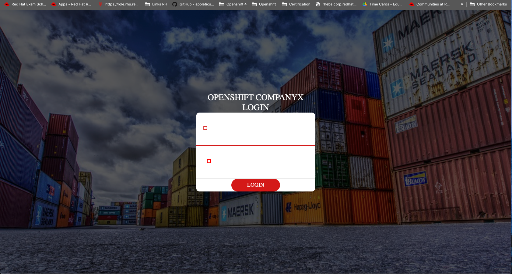

# Openshift Custom Login Page

In order to edit the Login oauths cluster page (Openshift Login page), I'll need to modify its default configuration.

First we'll create a secret in the openshift-config project, uploading our custom html data to the Openshift environment.

$ oc create secret generic login-template --from-file=login.html

Then, we'll modify the default oauth configuration, poiting to the custom file.

$ oc edit oauths cluster

spec:
  templates:
    login:
      name: login-template 

