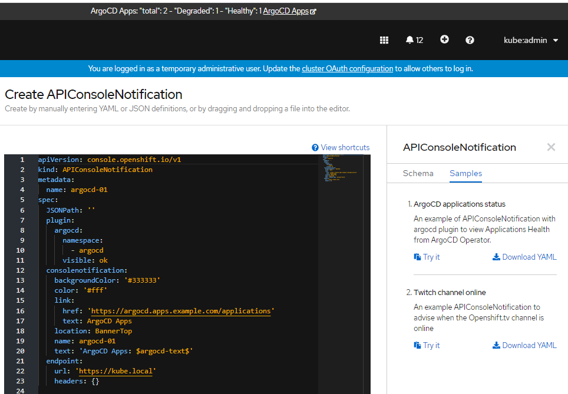
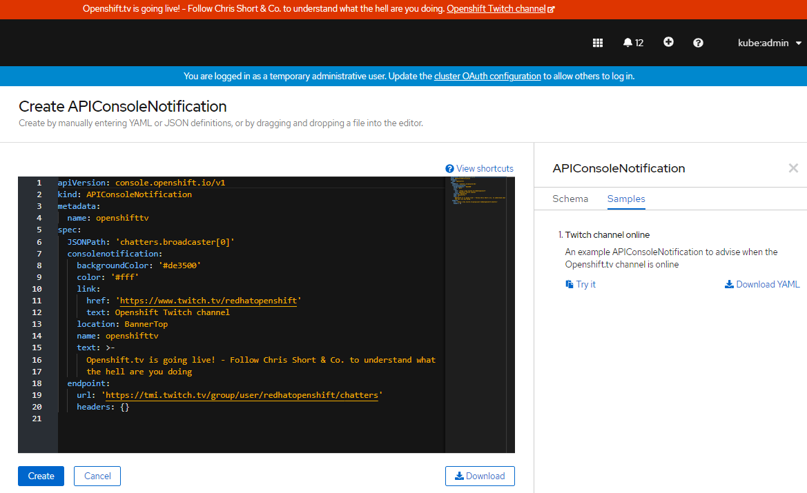

# ACN: ApiConsoleNotification

ACN is a Node.js application designed to extend the new functionality released on OCP 4.6 called ConsoleNotifications with the capability of calling apis to generate or delete ConsoleNotifications resources.

**LAST MINUTE UPDATE:**
I have added a plugin to check the ArgoCD applications health querying the CRD from it's operator



**Tested on OCP 4.6.1, released just to experience and [openshift-web-console-customizations](https://github.com/redhat-developer/openshift-web-console-customizations) competition.**



## Install

Run as cluster admin:

```oc apply -f templates``` 

If you want to try the ArgoCD plugin run also:

```oc apply -f templates/extra/argocd```

## Components

```templates/00-namespace.yaml``` declare the namespace acn.

```templates/10-bildconfig.yaml``` Build s2i with nodejs image and the code. Update if you want to deploy a fork.

```templates/20-crd-acn.yaml``` declare a new CRD called APIConsoleNotification. In it we can declare the endpoint to get, the ConsoleNofication spec to automate, and the JSONPath to search a valid result.

```templates/30-clusterrole.yaml``` ClusterRole with all rights over the resources apiconsolenotifications & consolenotifications in apiGroup console.openshift.io.

```templates/40-serviceaccount.yaml``` Service account 'acn' binded to ClusterRole 'acn' and mounted by the deploy.

```templates/50-clusterrolebinding.yaml``` Binding between clusterrole and serviceaccount.

```templates/60-apiconsolenotification.yaml``` Declare the instance of our CRD for the example of monitoring openshift.tv

```templates/70-consoleyamlsample.yaml``` It's declare a ConsoleYAMLSample for our CRD APIConsoleNotifications, it's the example needed to monitor openshift.tv.

```templates/80-deployment.yaml``` It use the serviceaccount, image from buildconfig, initContainer to copy oc CLI, etc. to deploy the pod.

```templates/90-imagestream.yaml``` Reference the image.

## ArgoCD components

```templates/extra/argocd/00-role.yaml``` Declare a role to get ArgoCD applications from a Namespace. Update the target Namespace if needed (default: argocd) 

```templates/extra/argocd/10-rolebinding.yaml``` Join the new role with the serviceaccount in 'acn' Namespace. Update the target Namespace if needed (default: argocd) 

```templates/extra/argocd/20-consoleyamlsample.yaml``` Example to create the apiconsolenotification CRD with ArgoCD Plugin.

## Code

```code/server.js``` 
- Every minute (scheduled with CronJob) fire a GET to k8s api getting all "APIConsoleNotifications".

- For each iteration it will call the endpoint and search in the response the JSONPath, knowing if it's online or not.

- As much as if it finds or not, launch a second k8s api but now for "ConsoleNotifications"

- Then it create or delete the parent ConsoleNotification related with APIConsoleNotification if apply.

```code/plugins/argocd.js``` 
- When the plugin argocd is declared, it will query all the applications.argoproj.io from a namespace and add all the status to the ConsoleNotification text.

## TODO

- It can use as startpoint for simple integration to create any k8s api object based on custom api requests.

- Also I want to build it with OperatorSDK, some volunteer to explain how to create it from scratch? it could be an interesting session for Openshift.tv channel.

- Extend the posibilities: ~~thinking about query directly k8s objects instead external services, and create a CustomNotification or other objects based on ArgoCD "OutOfSyncs"~~<sub>done</sub>, quotas, prometheus metrics...