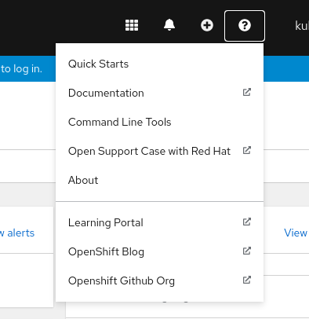
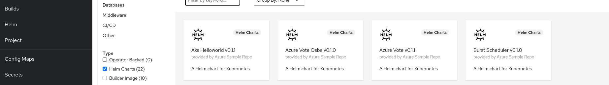

# OpenShift Web Console Customization Competition
This is Pratik Jagrut's entry for the OpenShift Web Console Customization competition.

## Customization details

### Adding link of Openshift github org in the links menu. 

This might not be any organization level or important change but it helps to be closer and aware of the development of openshift components.



### Adding Helm Repositories

Helm is somewhat magic tool and keeping its repo in openshift cluster comes handy.



## How to install

### Openshift github org link

This is a yaml to append a link in links dropdown.
This will create a CR of kind `ConsoleLink` in a cluster.

```yaml
apiVersion: console.openshift.io/v1
kind: ConsoleLink
metadata:
  name: openshift-github-org
spec:
  href: 'https://github.com/openshift'
  location: HelpMenu 
  text: "Openshift Github Org"
```

```
oc apply -f ./link.yaml
```

### Adding Helm Repositories

This is yaml to add helm repo in openshift cluster.

I'm using azure sample helm repo to demonstrate.

```yaml
apiVersion: helm.openshift.io/v1beta1
kind: HelmChartRepository
metadata:
  name: azure-sample-repo
spec:
  name: azure-sample-repo
  connectionConfig:
    url: https://raw.githubusercontent.com/Azure-Samples/helm-charts/master/docs
```

```
oc apply -f ./helm-repo.yaml
```

