# OpenShift Web Console Customization Competition

Rejeeb Abdul Rahiman's entry for the OpenShift Web Console Customization Competition.

## Customization details:

You can customize the OpenShift Container Platform web console to set a custom logo, product name, links, notifications, and command-line downloads. These are especially helpful if you need to tailor the web console to meet specific corporate or government requirements.

### Adding a custom logo and product name

* Logos are the face of a business, product, or service. A software customized with the company logo can generate more trust and recognition.

*Procedure to add your company logo within OpenShift:*

1. Import your logo file into a config map in the openshift-config namespace:
```
$ wget https://raw.githubusercontent.com/rejeeb786/openshift-web-console-customizations/master/competition/rejeeb786/assets/images/console-custom-logo.png
$ oc create configmap console-custom-logo --from-file console-custom-logo.png -n openshift-config
```
2. Patch the web console’s Operator configuration to include customLogoFile and customProductName:
```
$ oc patch console.operator.openshift.io cluster --type='merge' --patch '{"spec":{"customization": { "customLogoFile": {"key":"console-custom-logo.png","name": "console-custom-logo"},"customProductName":"Sample Company Inc"}}}'
```
[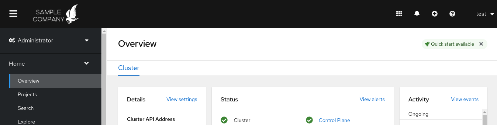](./assets/screenshots/CustomLogoScreenshot.png)

### Creating custom links in the web console

* Custom links within the OpenShift cluster provide the user with a hassle-free experience while interacting with other domains of the organization. Also, it makes many essential links easily accessible while administering your cluster.

*Procedure to add custom links within OpenShift:*

 #### Custom links within the `Help Menu`:
  1. YAML file definition to add the link to the `Latest OCP Release`.
   > Link to the latest OCP releases helps the customer to stay updated with the latest versions of OpenShift Container Platform.
```
$ cat << 'EOF' > console-link-help-menu-1.yaml
apiVersion: console.openshift.io/v1
kind: ConsoleLink
metadata:
  name: latest-ocp-release
spec:
  href: 'https://docs.openshift.com/container-platform/latest/release_notes/ocp-4-6-release-notes.html'
  location: HelpMenu 
  text: Latest OCP Release
EOF
```
```
$ oc apply -f console-link-help-menu-1.yaml
```
  2. YAML file definition to add the link to the `Red Hat CVE Database`.
   > Link to the Red Hat CVE database helps the customer to get updates on the latest common vulnerabilities and exposures, which in turn helps to take proactive measures within the cluster if required.
```
$ cat << 'EOF' > console-link-help-menu-2.yaml
apiVersion: console.openshift.io/v1
kind: ConsoleLink
metadata:
  name: rh-cve-db
spec:
  href: 'https://access.redhat.com/security/security-updates/#/cve'
  location: HelpMenu 
  text: Red Hat CVE Database
EOF
```
```
$ oc apply -f console-link-help-menu-2.yaml
```
  3. YAML file definition to add the link to `Contact Red Hat`.
   >  This particular link would serve as a single directory wherein customers can find contact information for Enterprise or Corporate Sales Inquiries, Customer Service, Technical Support, Training & Certifications, Security Contacts, Product Questions & Suggestions, and Worldwide Offices.
```
$ cat << 'EOF' > console-link-help-menu-3.yaml
apiVersion: console.openshift.io/v1
kind: ConsoleLink
metadata:
  name: contact-rh
spec:
  href: 'https://access.redhat.com/support/contact?intcmp=hp|a|a4|contact&'
  location: HelpMenu 
  text: Contact Red Hat
EOF
```
```
$ oc apply -f console-link-help-menu-3.yaml
```
[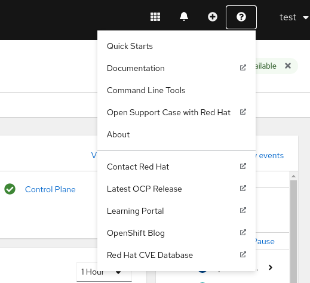](./assets/screenshots/HelpMenuScreenshot.png)

 #### Custom links within the `User Menu`:
  1. YAML file definition to add the link to `Change Password` of the user.
   > It can be strenuous to figure out if someone else is using your account, so having an option to change your password helps to keep your account more secure and reduce the risk of unauthorized access to your account.
```
$ cat << 'EOF' > console-link-user-menu-1.yaml
apiVersion: console.openshift.io/v1
kind: ConsoleLink
metadata:
  name: change-password
spec:
  href: 'https://sample-link-to-the-password-reset-page-of-the-organization'
  location: UserMenu 
  text: Change Password
EOF
```
```
$ oc apply -f console-link-user-menu-1.yaml
```
  2. YAML file definition to add the link to `Contact IT Team` of the organization.
   > A user might face multiple issues with the infrastructure or the network and might require expertise support from the IT team of their organization.
```
$ cat << 'EOF' > console-link-user-menu-2.yaml
apiVersion: console.openshift.io/v1
kind: ConsoleLink
metadata:
  name: contact-it-team
spec:
  href: 'https://example.com/it-support'
  location: UserMenu 
  text: Contact IT Team
EOF
```
```
$ oc apply -f console-link-user-menu-2.yaml
```
[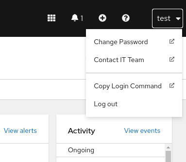](./assets/screenshots/UserMenuScreenshot.png)

 #### Custom links within the `Application Menu`:
  1. YAML file definition to add the link to `Red Hat Subscription Management`.
   > This link helps the customer to obtain a summary of all active subscriptions and purchased products for their organization account.
```
$ cat << 'EOF' > application-menu-link-1.yaml
apiVersion: console.openshift.io/v1
kind: ConsoleLink
metadata:
  name: my-subscriptions
spec:
  href: 'https://access.redhat.com/management'
  location: ApplicationMenu
  text: Red Hat Subscription Management
  applicationMenu:
    section: My Subscriptions
    # image that is 24x24 in size
    imageURL: https://raw.githubusercontent.com/rejeeb786/openshift-web-console-customizations/master/competition/rejeeb786/assets/images/AppMenu1.png
EOF
```
```
$ oc apply -f application-menu-link-1.yaml
```
  2. YAML file definition to add the link to `Launch a Meeting`.
   > For remote troubleshooting or administrative assistance/meeting, a user can launch meeting(s) from this link directly.
```
$ cat << 'EOF' > application-menu-link-2.yaml
apiVersion: console.openshift.io/v1
kind: ConsoleLink
metadata:
  name: connect
spec:
  href: 'https://meet.google.com/'
  location: ApplicationMenu
  text: Launch a Meeting
  applicationMenu:
    section: Connect
    # image that is 24x24 in size
    imageURL: https://raw.githubusercontent.com/rejeeb786/openshift-web-console-customizations/master/competition/rejeeb786/assets/images/AppMenu2.png
EOF
```
```
$ oc apply -f application-menu-link-2.yaml
```
[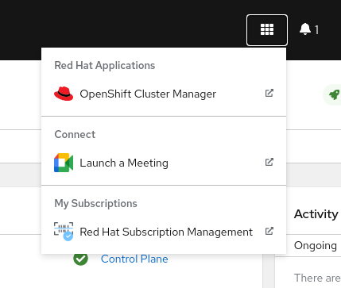](./assets/screenshots/AppMenuScreenshot.png)
 #### Custom links within the `Namespace Dashboard`:
  1. YAML file definition to add the link to `Report Anomaly` within the cluster/project.
   > A user could report and provide necessary data and information of any detected anomalies within the cluster or project to the development or the project team.
```
$ cat << 'EOF' > namespaced-dashboard-1.yaml
apiVersion: console.openshift.io/v1
kind: ConsoleLink
metadata:
  name: namespaced-dashboard-link-for-all-namespaces
spec:
  href: 'https://www.example.com/report-cluster-anomaly'
  location: NamespaceDashboard
  text: Report Anomaly
EOF
```
```
$ oc apply -f namespaced-dashboard-1.yaml
```
[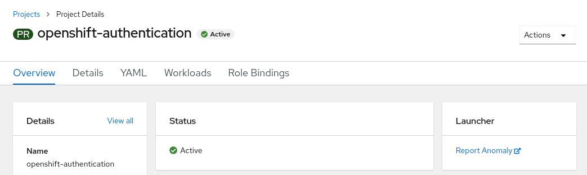](./assets/screenshots/NamespaceScreenshot1.png)
  2. YAML file definition to add the link to `Request Elevated Privileges` within a project.
   > User(s) might need to perform some tasks that would require elevated privileges or assistance of a user who has certain privileges. This link would help the user to request the same if necessary. These links are only given in specific projects depending on the requirement.
```
$ cat << 'EOF' > namespaced-dashboard-2.yaml
apiVersion: console.openshift.io/v1
kind: ConsoleLink
metadata:
  name: namespaced-dashboard-for-some-namespaces
spec:
  href: 'https://www.example.com/request-for-elevated-privileges'
  location: NamespaceDashboard
  text: Request Elevated Privileges
  namespaceDashboard:
    namespaces:
    - sample-namespace
    - test-namespace
EOF
```
```
$ oc apply -f namespaced-dashboard-2.yaml
```
[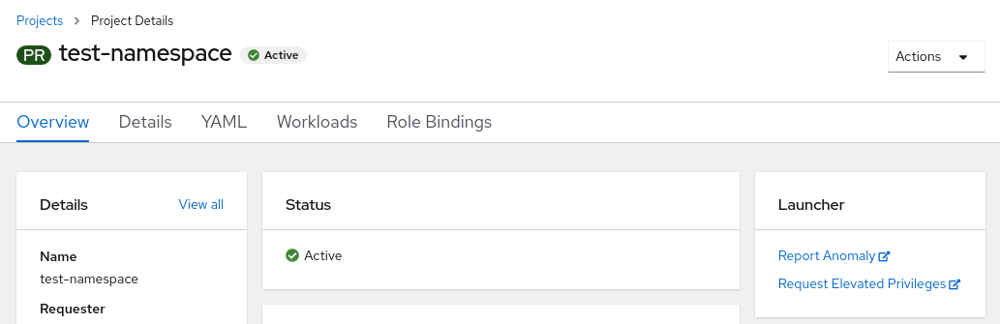](./assets/screenshots/NamespaceScreenshot2.png)
### Customizing the login page

* Custom login pages can be helpful to show users a branded page that they trust and expect before being redirected to the authentication provider or any other page. You can render custom error pages during the authentication process as well.

*Procedure to add customized page in OpenShift:*

  1. Customized `identity provider selection` page:
```
$ wget https://raw.githubusercontent.com/rejeeb786/openshift-web-console-customizations/master/competition/rejeeb786/assets/codes/providers.html
$ oc create secret generic providers-template --from-file=providers.html -n openshift-config
$ oc patch oauths cluster --type='merge' --patch '{"spec":{"templates": { "providerSelection": {"name":"providers-template"}}}}'
```
[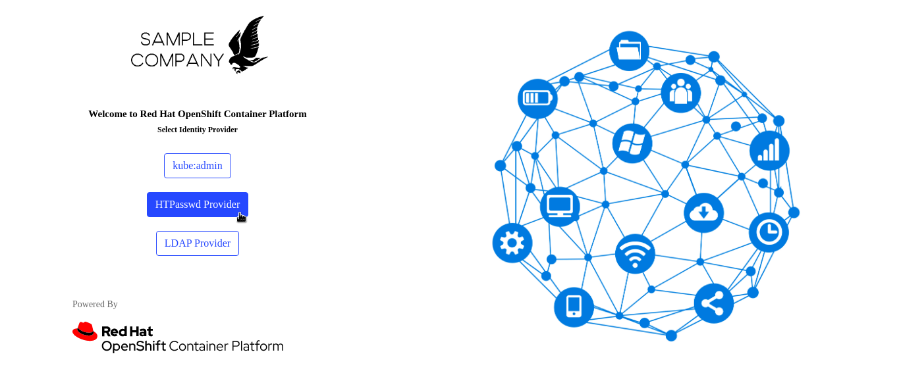](./assets/screenshots/IDPSelectionPageScreenshot.png)
  2. Customized `login` page:
```
$ wget https://raw.githubusercontent.com/rejeeb786/openshift-web-console-customizations/master/competition/rejeeb786/assets/codes/login.html
$ oc create secret generic login-template --from-file=login.html -n openshift-config
$ oc patch oauths cluster --type='merge' --patch '{"spec":{"templates": { "login": {"name":"login-template"}}}}'
```
[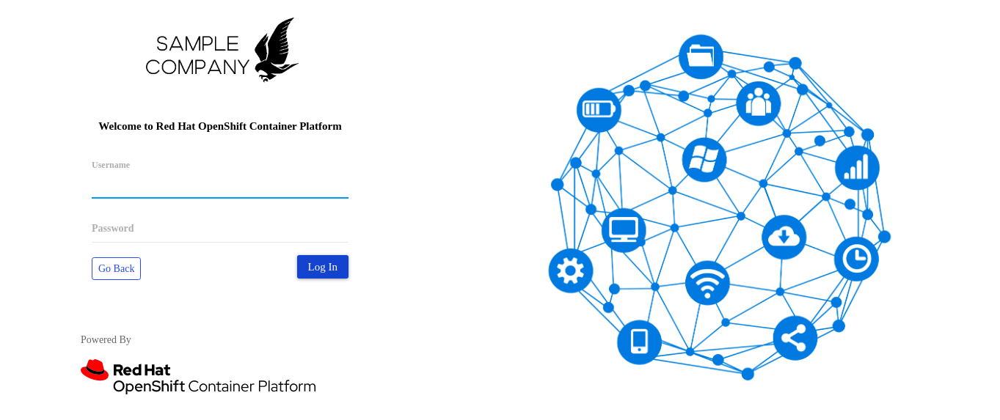](./assets/screenshots/LoginPageScreenshot.png)
[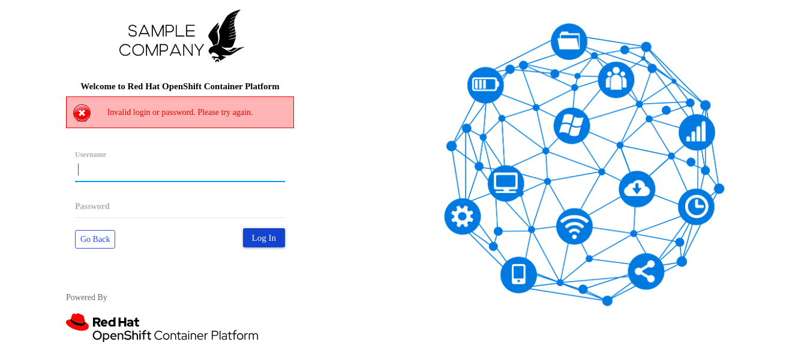](./assets/screenshots/LoginErrorScreenshot.png)
### Creating custom notification banners

* Notification banners help the administrators to let the users know regarding any events such as scheduled maintenance or cluster downtime. Also, it helps notify the users regarding any upcoming updates.

*Procedure to add custom notification banners within OpenShift:*

 #### Custom notification banners at the top of the page:
   > Notification banners at the top can be utilized to display any important updates or announcements or events.
```
$ cat << 'EOF' > banner-top.yaml
apiVersion: console.openshift.io/v1
kind: ConsoleNotification
metadata:
  name: banner-top
spec:
  text: Kindly note that we will be experiencing server downtime due to infrastructure maintenance on 31st December 2020 from 23:00 until 23:59.
  location: BannerTop 
  link:
    href: 'https://www.example.com/maintenance-schedule'
    text: Maintenance Schedule
  color: '#fff'
  backgroundColor: '#CC0000'
EOF
```
```
$ oc apply -f banner-top.yaml
```
[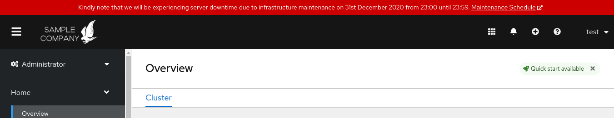](./assets/screenshots/BannerTopScreenshot.png)
 #### Custom notification banners at the bottom of the page:
   > Notification banners at the bottom can be utilized to provide some information to the users regarding the policy of usage.
```
$ cat << 'EOF' > banner-bottom.yaml
apiVersion: console.openshift.io/v1
kind: ConsoleNotification
metadata:
  name: banner-bottom
spec:
  text: Copyright © 2020 Sample Company, Inc. | 
  location: BannerBottom 
  link:
    href: 'https://www.example.com/data-protection-policy'
    text: Data Protection and Privacy Policy
  color: '#fff'
  backgroundColor: '#000'
EOF
```
```
$ oc apply -f banner-bottom.yaml
```
[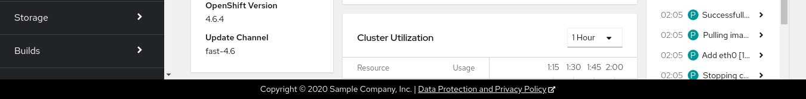](./assets/screenshots/BannerBottomScreenshot.png)
### Customizing CLI downloads

* You can configure links for downloading the CLI with custom link text and URLs, which can point directly to file packages or to an external page that provides the packages.

*Procedure to include custom download links within OpenShift:*

  * YAML file definition to include `GitHub CLI` download links.
   > gh is GitHub on the command line. It brings pull requests, issues, and other GitHub concepts to the terminal next to where you are already working with git and your code.
```
$ cat << 'EOF' > github-cli.yaml
apiVersion: console.openshift.io/v1
kind: ConsoleCLIDownload
metadata:
  name: github-cli
spec:
  description: |
    gh is GitHub on the command line. It brings pull requests, issues, and other GitHub concepts to the terminal next to where you are already working with git and your code. GitHub CLI is available for repositories hosted on GitHub.com and GitHub Enterprise Server 2.20+.
  displayName: GitHub CLI
  links:
  - href: 'https://github.com/cli/cli#homebrew'
    text: GitHub CLI for Linux
  - href: 'https://brew.sh/'
    text: GitHub CLI for Mac
  - href: 'https://github.com/microsoft/winget-cli'
    text: GitHub CLI for Windows
EOF
```
```
$ oc apply -f github-cli.yaml
```
[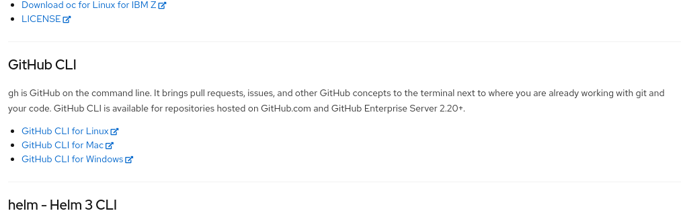](./assets/screenshots/GithubCLIScreenshot.png)
### Adding YAML examples to Kubernetes resources

* You can dynamically add YAML examples to any Kubernetes resources at any time. Providing sample YAML examples helps the user to understand it's working.

*Procedure to add YAML examples within OpenShift:*

  * YAML file definition to add a `Secret` YAML example.
   > The `Secret` object type provides a mechanism to hold sensitive information such as passwords, OpenShift Container Platform client configuration files, dockercfg files, private source repository credentials, and so on. Secrets decouple sensitive content from the pods. You can mount secrets into containers using a volume plug-in or the system can use secrets to perform actions on behalf of a pod.
```
$ cat << 'EOF' > secret-yaml-sample.yaml
apiVersion: console.openshift.io/v1
kind: ConsoleYAMLSample
metadata:
  name: secret-yaml-sample
spec:
  targetResource:
    apiVersion: v1
    kind: Secret
  title: Example Secret
  description: An example Secret YAML sample
  yaml: |
    apiVersion: v1
    kind: Secret
    metadata:
      name: example
    type: Opaque
    stringData:
      email: admin@example.com
      password: RedHat@OCP123!@#
EOF
```
```
$ oc apply -f secret-yaml-sample.yaml
```
[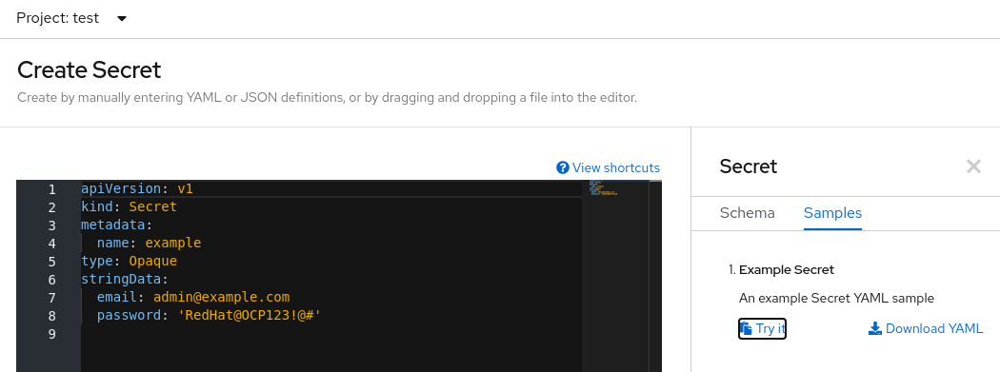](./assets/screenshots/SecretYAMLScreenshot.png)
  * YAML file definition to add a `ConfigMap` YAML example.
   > The `ConfigMap` API object holds key-value pairs of configuration data that can be consumed in pods or used to store configuration data for system components such as controllers. ConfigMap is similar to secrets, but designed to more conveniently support working with strings that do not contain sensitive information.
```
$ cat << 'EOF' > configmap-yaml-sample.yaml
apiVersion: console.openshift.io/v1
kind: ConsoleYAMLSample
metadata:
  name: configmap-yaml-sample
spec:
  targetResource:
    apiVersion: v1
    kind: ConfigMap
  title: Example ConfigMap
  description: An example ConfigMap YAML sample
  yaml: |
    apiVersion: v1
    kind: ConfigMap
    metadata:
      name: special-config 
    data:
      company.name: sample 
      company.product: ocp 
EOF
```
```
$ oc apply -f configmap-yaml-sample.yaml
```
[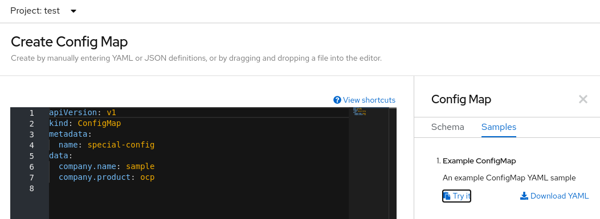](./assets/screenshots/ConfigmapYAMLScreenshot.png)
## Want to try out these customizations?

You could try out all the customizations mentioned above in just 3-steps! You could revert it as well.

### 3-Steps to apply all the customizations mentioned above
```
$ wget https://raw.githubusercontent.com/rejeeb786/openshift-web-console-customizations/master/competition/rejeeb786/assets/codes/customization.sh
$ chmod a+x customization.sh
$ ./customization.sh
```
### 3-Steps to revert those customizations
```
$ wget https://raw.githubusercontent.com/rejeeb786/openshift-web-console-customizations/master/competition/rejeeb786/assets/codes/remove-customization.sh
$ chmod a+x remove-customization.sh
$ ./remove-customization.sh
```
