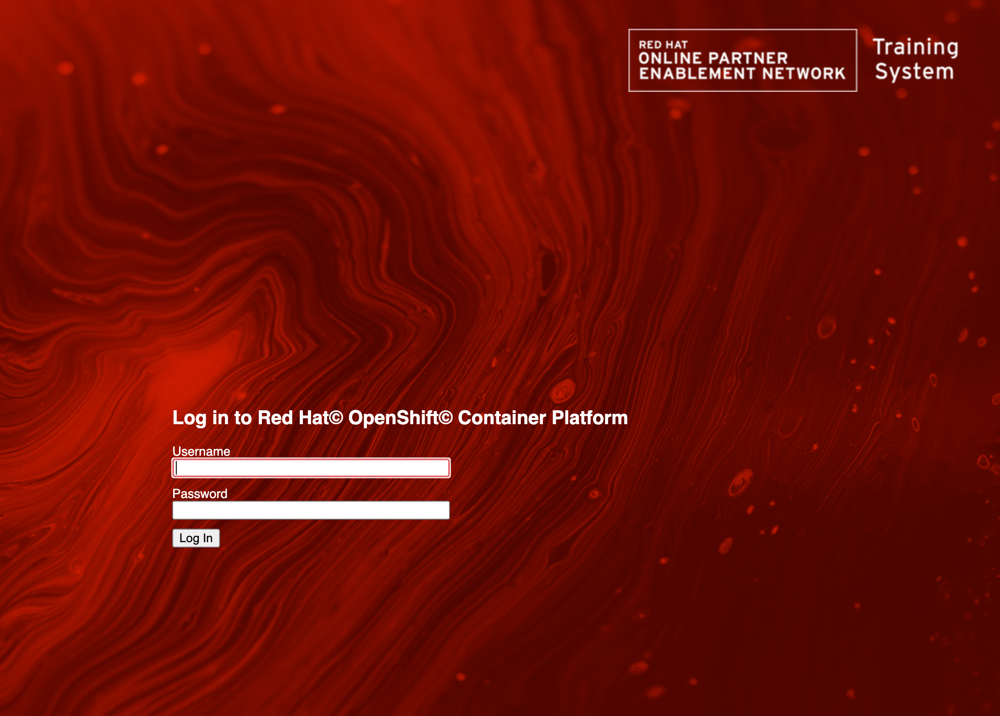
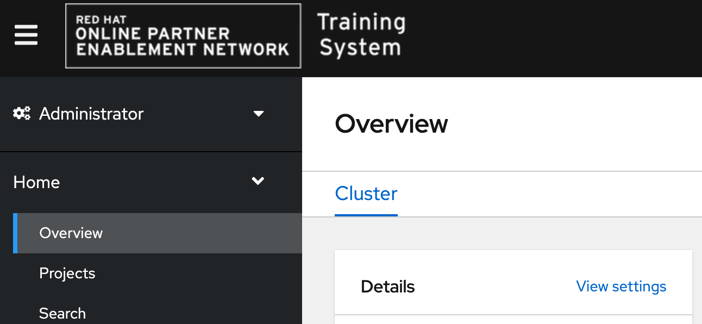
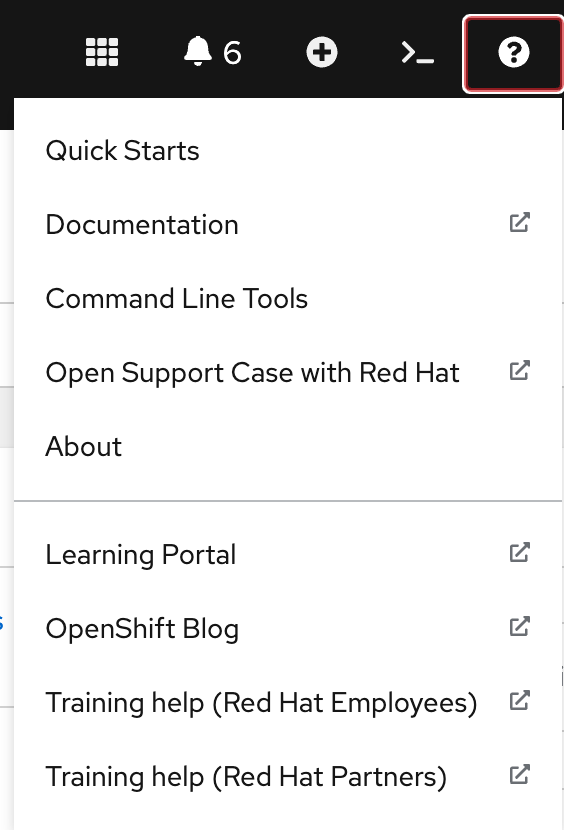

# OpenShift Web Console Customization Competition

This is **Wolfgang Kulhanek**'s entry for the OpenShift Web Console Customization competition.

Wolfgang is responsible for OpenShift Container Platform Clusters used in Red Hat and Partner training. Clusters are being requested using a provisioning portal.

## Customization details:

* Use the same background and logo for the OpenShift login page as is used in the provisioning portal for consistent look and feel:

  [](./images/custom_login_screen.png)

* In case more than one authentication provider is configured display specific hints on how to log into the cluster using either LDAP credentials or HTPassword credentials.

* Replace the OpenShift logo in the console with the Red Hat Training System Logo:

  [](./images/custom_logo.png)

* Add two help links to the Help menu in the console for Red Hat employees and Red Hat partners to request help with their lab environment. This gives users a quick way to request help if they get stuck while working through a hands-on lab.

  [](./images/custom_help_menu.png)

## How to install

* Two images have been uploaded to a public AWS S3 Bucket
  * The Background for the login screen
  * The custom logo. Note that the logo is also added as a ConfigMap but needs to be accessible for the custom login page.

### Customizing the login page

* Create a secret for the custom login page:
  ```
  oc create secret generic login-template --from-file=./html/login.html -n openshift-config
  ```
* Create a secret for the custom provider selection page:
  ```
  oc create secret generic providers-template --from-file=./html/providers.html -n openshift-config
  ```
* Update the `OAuth` custom resource named `cluster` to use these HTML files:
  ```
  oc patch oauth cluster --type='merge' --patch '{"spec":{"templates": {"login":{"name":"login-template"},"providerSelection":{"name":"providers-template"}}}}'
  ```

### Customizing the Logo in the web console

* Create a config map which includes the image for the custom logo:
  ```
  oc create configmap console-custom-logo --from-file ./images/opentlc_logo.png -n openshift-config
  ```
* Update the `console.operator.openshift.io` custom resource named `cluster` to use that logo and a custom product name:
  ```
  oc patch console.operator.openshift.io cluster --type='merge' --patch '{"spec":{"customization": { "customLogoFile": {"key":"opentlc_logo.png","name": "console-custom-logo"},"customProductName":"OpenTLC Training System"}}}'
  ```

### Customizing the Help Menu

* Simply create the two provided `ConsoleLink` custom resources:
  ```
  oc apply -f ./yaml/rhpds_help_internal_link.yaml
  oc apply -f ./yaml/rhpds_help_partners_link.yaml
  ```

## AgnosticD Workload

A workload has been written to deploy the customization to any OpenShift cluster: https://github.com/redhat-cop/agnosticd/tree/development/ansible/roles_ocp_workloads/ocp4_workload_opentlc_webconsole

This workload can be customized with image URLs, ConsoleLinks as well as header text.
