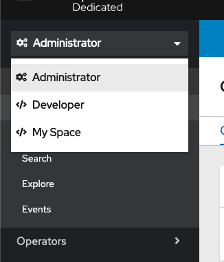
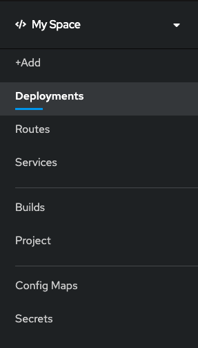

# OpenShift Web Console Customization Competition

Wojciech Trocki entry for the OpenShift Web Console Customization Competition.
It might be invalid due to not following the rules, but I wanted to drop some of the ideas for customizations.

## Customization details:

As customization options are fairly limited to icons and notifications which are on its own are trivial and limiting creativity. I wanted to see how we can extend current customization engine to deliver more customizations.
I have started experimenting with overal OpenShift customization on code level and seeing if there is easy way to add some plugability/extensions to address issues of the UI I have known from the field.
As my entry I would like to propose concept of organizing your own sidebar in openshift by defining new roles in the team.

New space reachable in the dropdown


Defined space


## Definition of the problem

When working with the field we often see developers asking us about personas they need to define and 
map to successfuly manage and deploy their applications to production.
OpenShift UI enforces two major personas (Administrator and Developer)
While those are the most common use cases that organizations facing some of the organizations intentionally
want to adopt more modern devops solution and scale by having dev and production clusters respectively.

As results developers working on cluster would have full access to the admin section - they respectively develop software, 
write operators specific to their problems and stage them to the clusters (AKA modern devops persona).

When working on the field we often seen that OpenShift UI customization is the key element 
to the success of the initial onboarding and future work, however currently OpenShift UI come as it is 
with redefined workflows and sections that are done using `one size fits all` approach.

Why UI sidebar can be customized

- Definition of the Adminstrator and Developer not fitting really well with modern use cases (more traditial personas)
- In many feedback  and interactions we seen that Developer section is not that useful for people as they need to navigate
to admin many times
- Old openshift users tend to use cli that allows to get information much faster (UI is slower)
- Developers who do not have CLI or their admins do not allow to install some software often need to open multiple tabs with openshift console to support their workflows and do things fast.
- It is critical to get UI customized for situations when time matters (evaluating issues on server etc). Monitoring etc.
Current solution for this is to use IFrames - but that is tricky due to auth logic.
- Moving from 3.x to 4.x for developers makes their workflows much harder - average number of navigations is much higher due to restrictions

How to resolve them

### Possible solution

Allow administrators/users to define their own space with sitebars conntaining only sections they need.
Admins will be able to compose those by two new resources:

- **SidebarItem**
Defines existing core sidebars (in future can enable extension mechanism for user defined sitebars)
- **CustomSidebar**
Creates sitebar with references to existing sidebar elements

### Alternatives you have considered

1) I have done quick investigation for usage based solution that keeps most used tabs in one place.

While trivial to implement (there will be need for API that counts usage of the sections and show the most used ones)
They can be made for the user or cluster wide. However this can be seen as separate feature to the self designed sidebar.


2) Greasemonkey scripts/Browser plugins

Adding browser plugin that will enable similar functionality without operator for the user 
can be considered however I wanted to build something more OpenShift native so did not spent much 
time validating this option. This will require plugin for different browsers etc.

## Technical details

I cannot push codebase here because it is simply too large to be merged. 
Adding some examples to show how this could work

### Finding about currently supported sidebar items.

Each existing sidebar will need to be represented as CR and could be obtained by user.
Sitebars will have unique name and href and additional metadata in future to support customizations.

OpenShift Sidebaritems available as CR 

`oc get sidebaritem` (uses operator for listing sidebars)

### Creating your own space in the sidebar

`oc apply -f sidebaritem.yml` (uses operator for registration of the sidebar)

Sidebar definitions could look as follows
```
apiVersion: operators.coreos.com/v1alpha1
kind: CustomSidebar
metadata:
  name: My Sitebar
spec:
  sitebars:
     - v1core.Deployment
     - v1core.Services
```


