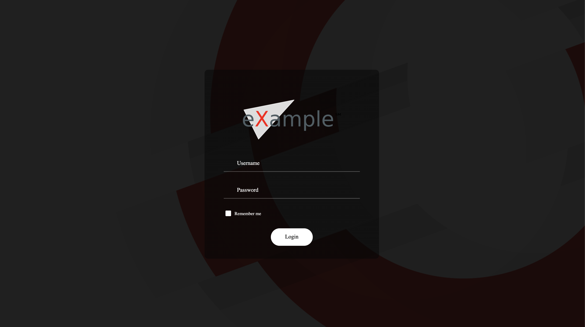

# Openshift Login Page Custom




### To configure this custom page in your Openshift, follow the steps below

- Create a new secret in openshift-config project:

```bash
oc create secret generic login-template --from-file=login.html -n openshift-config
```

- After that, execute the command below to edit ***oauths cluster***
```bash
oc edit oauths cluster
```

- Add this lines:
```yaml
spec:
  templates:
    login:
      name: login-template or secret-name
```