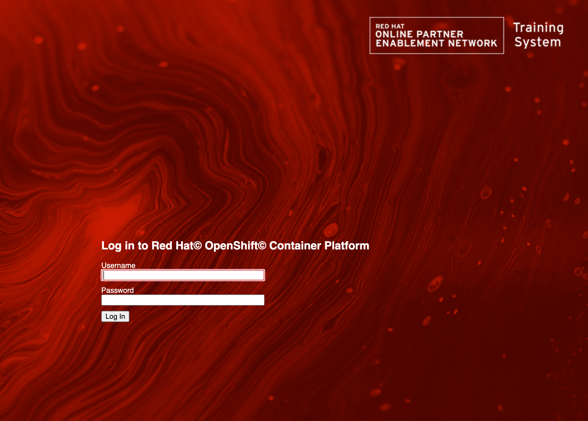
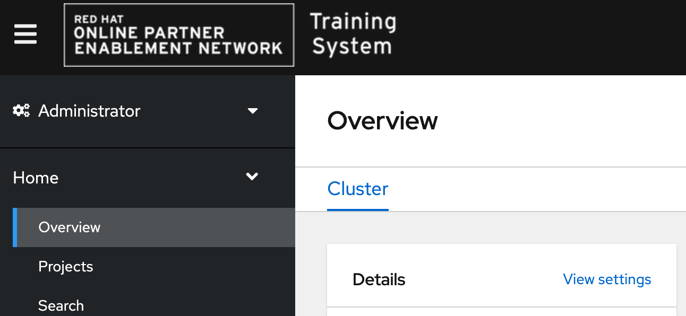

== OpenShift Web Console Customization Competition

This is Wolfgang Kulhanek's entry for the OpenShift Web Console Customization competition.

Wolfgang is responsible for OpenShift Container Platform Clusters used in Red Hat and Partner training. Clusters are being requested using a provisioning portal.

This customization does the following:

* Use the same background and logo for the OpenShift Login Page
+
 {:width=400px }
* In case more than one authentication provider is configured display specific hints on how to log into the cluster
* Replace the OpenShift logo in the console with the Red Hat Training System Logo
+
 { width=50%}
* Add two help links to the Help menu in the console for Red Hat employees and Red Hat partners to request help with their lab environment
+
image:./images/custom_help_menu.png
